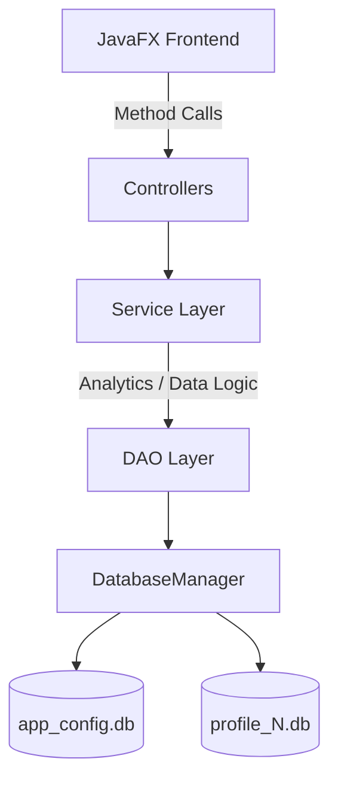

# Punch IT

A robust JavaFX desktop application for managing student attendance, featuring multi-profile support, real-time analytics, and intelligent attendance target tracking.


## Project Overview
Punch IT solves the problem of manual attendance tracking by providing a localized, multi-profile desktop application. Designed primarily for students and educators, it allows users to monitor their attendance targets, visualize their progress via heatmaps, and intelligently predict classes needed to meet specific thresholds. It stands out due to its clean MVC architecture, local persistence, and custom analytical algorithms running entirely on the client side without external dependencies. The application supports an unlimited number of profiles, making it scalable for shared devices.

## Architecture Diagram


## Key Features
- **Multi-Profile System** — Manages separate SQLite databases (`profile_N.db`) per user while keeping global configurations in a central database (`app_config.db`).
- **Target Tracking & Predictions** — Evaluates attendance history to compute the exact number of future classes required to meet a user-defined target percentage, utilizing real-time arithmetic models.
- **Data Visualization** — Generates monthly and yearly heatmaps based on local `AttendanceRecord` models to visually indicate attendance density and trends.
- **Offline First** — Runs entirely locally utilizing SQLite and JDBC, ensuring privacy and offline functionality.
- **Legacy Migration System** — Automatically detects and migrates legacy single-user databases (`attendance.db`) to the new multi-profile schema without data loss.

## Tech Stack
| Component | Technology | Purpose |
| --- | --- | --- |
| Core Language | Java 21 | Application logic and object-oriented structure |
| UI Framework | JavaFX 21.0.1 | Frontend rendering, FXML, and CSS styling |
| Database | SQLite 3.45.0.0 | Local data persistence and schema management |
| Build Tool | Maven 3.11.0 | Dependency management and packaging |
| Testing | JUnit Jupiter 5.10.1 | Unit testing framework (optional) |

## Project Structure
```text
attendance-manager/
├── src/main/java/com/attendancemanager/
│   ├── App.java                   # Main application entry point
│   ├── component/                 # Reusable JavaFX UI components (AnimatedCircle, etc.)
│   ├── context/                   # Context managers (UserContext)
│   ├── controller/                # JavaFX Controllers (Dashboard, Analytics, ProfileSelection)
│   ├── dao/                       # Data Access Objects (Attendance, Profile, Subject, Timetable)
│   ├── model/                     # Data entities (Subject, Profile, AttendanceRecord)
│   ├── service/                   # Business logic (AnalyticsService, AttendanceService)
│   └── util/                      # Utilities (DatabaseManager for SQLite connection pooling)
├── src/main/resources/com/attendancemanager/
│   ├── css/                       # Custom stylesheets (dark-theme, styles)
│   ├── icons/                     # Application assets
│   └── view/                      # FXML layout definitions
├── app_config.db                  # Central configuration database (auto-generated)
├── profile_N.db                   # Profile-specific databases (auto-generated)
└── pom.xml                        # Maven dependencies and plugin configuration
```

## API Reference
*Note: This is a standalone desktop application. It utilizes internal service layers rather than exposed REST endpoints. Key internal service methods are documented below.*

| Service Class | Method | Description | Auth Required |
| --- | --- | --- | --- |
| `AnalyticsService` | `getMonthlyAttendancePercentages(subjectId, year)` | Calculates monthly attendance percentages | No |
| `AnalyticsService` | `getYearHeatmapData(subjectId, year)` | Returns date-to-status map for UI heatmaps | No |
| `AnalyticsService` | `getOverallStatistics()` | Aggregates total classes, safe vs risk subjects | No |
| `DatabaseManager` | `switchProfile(profileId)` | Re-routes the JDBC connection to a specific profile DB | No |

## Database Schema

**app_config.db (Global Settings)**
| Table | Key Columns | Relationships |
| --- | --- | --- |
| `profiles` | `id` (INTEGER PK), `name` (TEXT), `created_at` (TIMESTAMP) | None |

**profile_{id}.db (User Data)**
| Table | Key Columns | Relationships |
| --- | --- | --- |
| `subjects` | `id` (INTEGER PK), `name` (TEXT), `target_percentage` (REAL) | None |
| `attendance_records` | `id` (INTEGER PK), `subject_id` (INTEGER FK), `date` (DATE), `status` (TEXT) | FK to `subjects(id)` |
| `timetable` | `id` (INTEGER PK), `subject_id` (INTEGER FK), `day_of_week` (TEXT), `start_time` (TEXT) | FK to `subjects(id)` |
| `settings` | `key` (TEXT PK), `value` (TEXT) | None |

## ML Pipeline
*N/A - The intelligent predictions utilize deterministic algorithms rather than machine learning models.*

## Environment Variables
*N/A - The application configures itself locally and requires no environment variables.*

## Getting Started

### Prerequisites
- **Java Development Kit (JDK) 21**
- **Maven 3.6+**

### Installation
1. Clone the repository:
   ```bash
   git clone https://github.com/Abhishek-Pandey786/punch-it.git
   cd punch-it
   ```

2. Build the project:
   ```bash
   mvn clean install
   ```

### Running Locally
Run the application using the JavaFX Maven plugin:
```bash
mvn javafx:run
```

Alternatively, build and run the executable JAR:
```bash
mvn clean package
java -jar target/attendance-manager-1.0.0.jar
```

## Docker Setup
*N/A - This is a native desktop application.*

## Screenshots / Demo
*(Add screenshots here showcasing the Dashboard, Analytics Heatmap, and Profile Selection)*

## Known Limitations
- The application currently lacks a remote synchronization feature; all data is strictly localized and vulnerable to local drive failure.
- There is no authentication or password protection for profiles; any user with access to the machine can open any profile.
- JavaFX dependencies must be present in the module path if not using the packaged Maven shade plugin.

## Future Improvements
- Implement an automated local backup mechanism (e.g., daily SQLite `.bak` exports).
- Add remote cloud synchronization via a centralized REST API backend.
- Introduce password-protected profiles for enhanced local privacy.
- Develop unit tests with pytest (or JUnit) for core application logic and algorithms.

## Author
**Abhishek Pandey**
- GitHub: [@Abhishek-Pandey786](https://github.com/Abhishek-Pandey786)
